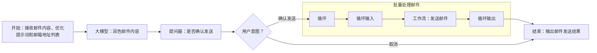

# 批量邮件发送工作流

## 工作流描述

工作流描述：你可以使用邮件发送工作流。邮件发送工作流的入参为email_content和recipient，出参为message，id为1234567

## 用户输入

搭建一个批量发送邮件的工作流。流程接收邮件正文模板、修改提示词和待发送邮箱列表，先通过大模型基于修改提示词对邮件正文进行优化，然后向用户输出优化后的邮件内容，然后接收用户反馈，当接收到“确认”、”无问题“等肯定回复后启动循环，遍历这个列表，调用“发送邮件”工作流将邮件发送到对应邮箱，子工作流会返回邮件发送结果，最后输出发送结果列表。如果接收到其他意图，直接结束流程。

## Mermaid格式的工作流任务流程图



## 生成json结果

```json
[{"id": "node_start", "type": "Start", "parameters": {"outputs": [{"name": "query", "type": "string", "description": "用户输入"}, {"name": "email_content", "type": "string", "description": "邮件内容"}, {"name": "optimize_prompt", "type": "string", "description": "优化提示词"}, {"name": "recipient_list", "type": "array<string>", "description": "收件人列表"}]}, "next": "node_llm"}, {"id": "node_llm", "type": "LLM", "parameters": {"inputs": [{"name": "email_content", "type": "string", "value": "${node_start.email_content}"}, {"name": "optimize_prompt", "type": "string", "value": "${node_start.optimize_prompt}"}], "outputs": [{"name": "output", "type": "string", "description": "大模型输出"}], "configs": {"system_prompt": "你需要根据用户输入修改邮件内容", "user_prompt": "要求：{{query}}，邮件内容：{{email_content}}"}}, "next": "node_questioner"}, {"id": "node_questioner", "type": "Questioner", "parameters": {"inputs": [{"name": "content", "type": "string", "value": "${node_llm.output}"}], "outputs": [{"name": "option", "type": "string", "description": "用户选择"}], "configs": {"prompt": "查看修改后的邮件内容:{{content}}，确认是否发送"}}, "next": "node_intent_detection"}, {"id": "node_intent_detection", "type": "IntentDetection", "parameters": {"inputs": [{"name": "input", "type": "string", "value": "${node_questioner.option}"}], "configs": {"prompt": "你是一个分类器，可以根据用户输入选择正确的分支"}, "conditions": [{"branch": "branch_1", "expression": "${node_intent_detection.rawOutput} contain 确认", "next": "node_loop"}, {"branch": "branch_0", "expression": "default", "next": "node_end"}]}}, {"id": "node_loop", "type": "Loop", "parameters": {"inputs": [{"name": "arr_loop_var", "type": "array<string>", "value": "${node_start.recipient_list}"}], "outputs": [{"name": "results", "type": "array<string>", "description": "发送结果", "value": "${node_workflow.message}"}], "configs": {"loop_type": "arrayLoop", "loop_body": ["node_loop_input", "node_workflow", "node_loop_output"]}}, "next": "node_end"}, {"id": "node_loop_input", "type": "LoopInput", "next": "node_workflow"}, {"id": "node_workflow", "type": "Workflow", "parameters": {"inputs": [{"name": "email_content", "type": "string", "value": "${node_llm.output}"}, {"name": "recipient", "type": "string", "value": "${node_loop.arr_loop_var.item}"}], "outputs": [{"name": "message", "type": "string", "description": "发送结果"}], "configs": {"workflow_id": "1234567", "workflow_name": "email_sender"}}, "next": "node_loop_output"}, {"id": "node_loop_output", "type": "LoopOutput", "next": "node_loop"}, {"id": "node_end", "type": "End", "parameters": {"inputs": [{"name": "send_results", "type": "array<string>", "value": "${node_loop.results}"}], "configs": {"template": "发送结果：{{send_results}}"}}}]
```

## 要点解释说明

