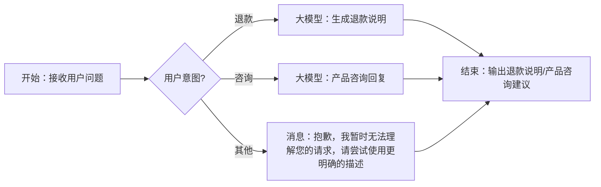

# 智能客服流程

## 用户输入

搭建一个智能客服工作流，用户输入问题后判断用户意图。当用户希望退款时，通过大模型根据公司退款政策，为用户提供退款说明。当用户进行咨询时，通过大模型根据问题提供相关产品咨询回复。两者都不是的时候输出'抱歉，我暂时无法理解您的请求，请尝试使用更明确的描述'

## Mermaid格式的工作流任务流程图



## 生成json结果

```json
[{"id": "node_start", "type": "Start", "parameters": {"outputs": [{"name": "query", "type": "string", "description": "用户输入"}]}, "next": "node_intent_detection"}, {"id": "node_intent_detection", "type": "IntentDetection", "parameters": {"inputs": [{"name": "input", "type": "string", "value": "${node_start.query}"}], "configs": {"prompt": "你是一个功能分类器，可以根据用户的请求，结合相应的功能类别描述，帮助用户选择正确的分支"}, "conditions": [{"branch": "branch_1", "expression": "${node_intent_detection.rawOutput} contain 退款", "next": "node_refund_handler"}, {"branch": "branch_2", "expression": "${node_intent_detection.rawOutput} contain 咨询", "next": "node_consult_handler"}, {"branch": "branch_0", "expression": "default", "next": "node_unknown_handler"}]}}, {"id": "node_refund_handler", "type": "LLM", "parameters": {"inputs": [{"name": "input", "type": "string", "value": "${node_start.query}"}], "outputs": [{"name": "output", "type": "string", "description": "退款说明"}], "configs": {"system_prompt": "请根据公司退款政策，为用户提供退款说明。", "user_prompt": "用户诉求：{{input}}"}}, "next": "node_end"}, {"id": "node_consult_handler", "type": "LLM", "parameters": {"inputs": [{"name": "input", "type": "string", "value": "${node_start.query}"}], "outputs": [{"name": "output", "type": "string", "description": "咨询回复"}], "configs": {"system_prompt": "请根据用户的问题提供相关产品咨询建议。", "user_prompt": "问题：{{input}}"}}, "next": "node_end"}, {"id": "node_unknown_handler", "type": "Output", "parameters": {"inputs": [], "configs": {"template": "抱歉，我暂时无法理解您的请求，请尝试使用更明确的描述。"}}, "next": "node_end"}, {"id": "node_end", "type": "End", "parameters": {"inputs": [{"name": "refund_response", "type": "string", "value": "${node_refund_handler.output}"}, {"name": "consult_response", "type": "string", "value": "${node_consult_handler.output}"}], "configs": {"template": "{{refund_response}}{{consult_response}}"}}}]
```

## 要点解释说明


