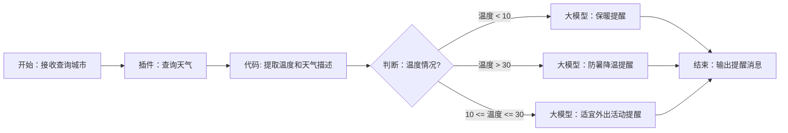

# 天气助手

## 插件描述

插件描述：你可以使用天气查询插件。预定飞机票插件的入参为city，出参为weather，id为mock_weather_id

## 用户输入

搭建一个天气助手工作流，用户输入城市名查询天气，并根据温度范围调用大模型生成自然语言回答，需要满足：当温度低于10度时，提醒用户注意保暖；温度高于30度时，提醒用户注意防暑降温；温度处于10-30度时，提醒用户温度适宜，推荐外出运动或游玩

## Mermaid格式的工作流任务流程图



## 生成json结果

```json
[{"id": "node_start", "type": "Start", "parameters": {"outputs": [{"name": "query", "type": "string", "description": "用户输入"}, {"name": "city", "type": "string", "description": "城市"}]}, "next": "node_plugin_weather"}, {"id": "node_plugin_weather", "type": "Plugin", "parameters": {"inputs": [{"name": "city", "type": "string", "value": "${node_start.city}"}], "outputs": [{"name": "weather", "type": "object", "description": "天气信息"}], "configs": {"apiId": "mock_weather_id", "tool_name": "get_weather_by_city"}}, "next": "node_code"}, {"id": "node_code_format", "type": "Code", "parameters": {"inputs": [{"name": "weather", "type": "object", "value": "${node_plugin_weather.weather}"}], "outputs": [{"name": "temperature", "type": "number", "description": "温度"}, {"name": "description", "type": "string", "description": "天气描述"}], "configs": {"code": "def main(args: dict):\n    weather = args.get('weather')\n    temper = weather.get('temperature')\n    desc = weather.get('description')\n    return {'temperature': temper, 'description': desc}"}}, "next": "node_check_temperature"}, {"id": "node_check_temperature", "type": "Branch", "parameters": {"conditions": [{"branch": "branch_1", "expression": "${node_code_format.temperature} shorter_than 10", "next": "node_llm_cold"}, {"branch": "branch_2", "expression": "${node_code_format.temperature} longer_than 30", "next": "node_llm_hot"}, {"branch": "branch_3", "expressions": ["${node_code_format.temperature} longer_than_or_eq 10", "${node_code_format.temperature} shorter_than_or_eq 30"], "operator": "and", "next": "node_llm_mild"}, {"branch": "branch_0", "expression": "default", "next": "node_end"}]}}, {"id": "node_llm_cold", "type": "LLM", "parameters": {"inputs": [{"name": "temperature", "type": "number", "value": "${node_code_format.temperature}"}, {"name": "description", "type": "string", "value": "${node_code_format.description}"}], "outputs": [{"name": "output", "type": "string", "description": "天气信息回复"}], "configs": {"system_prompt": "根据以下天气信息生成关怀提示，建议用户注意保暖：\n温度：{{temperature}}，天气状况：{{description}}", "user_prompt": ""}}, "next": "node_end"}, {"id": "node_llm_hot", "type": "LLM", "parameters": {"inputs": [{"name": "temperature", "type": "number", "value": "${node_code_format.temperature}"}, {"name": "description", "type": "string", "value": "${node_code_format.description}"}], "outputs": [{"name": "output", "type": "string", "description": "天气信息回复"}], "configs": {"system_prompt": "根据以下天气信息生成关怀提示，提醒用户注意防暑降温：\n温度：{{temperature}}，天气状况：{{description}}", "user_prompt": ""}}, "next": "node_end"}, {"id": "node_llm_mild", "type": "LLM", "parameters": {"inputs": [{"name": "temperature", "type": "number", "value": "${node_code_format.temperature}"}, {"name": "description", "type": "string", "value": "${node_code_format.description}"}], "outputs": [{"name": "output", "type": "string", "description": "天气信息回复"}], "configs": {"system_prompt": "根据以下天气信息生成关怀提示，建议用户外出活动：\n温度：{{temperature}}，天气状况：{{description}}", "user_prompt": ""}}, "next": "node_end"}, {"id": "node_end", "type": "End", "parameters": {"inputs": [{"name": "cold_weather_response", "type": "string", "value": "${node_llm_cold.output}"}, {"name": "mild_weather_response", "type": "string", "value": "${node_llm_mild.output}"}, {"name": "hot_weather_response", "type": "string", "value": "${node_llm_hot.output}"}], "configs": {"template": "{{cold_weather_response}}{{mild_weather_response}}{{hot_weather_response}}"}}}]
```

## 要点解释说明

