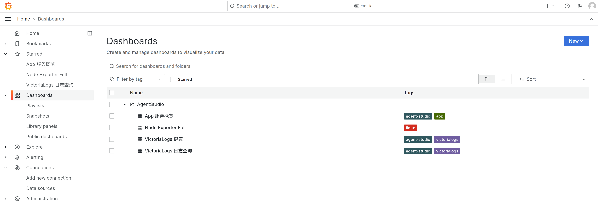
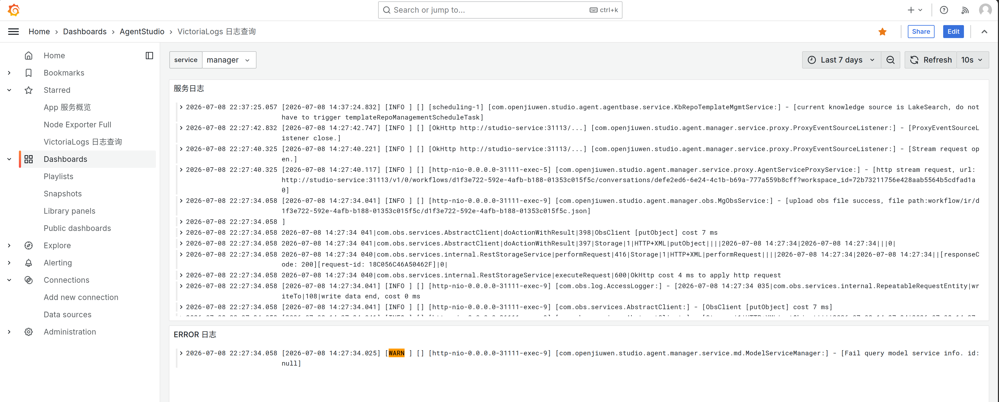
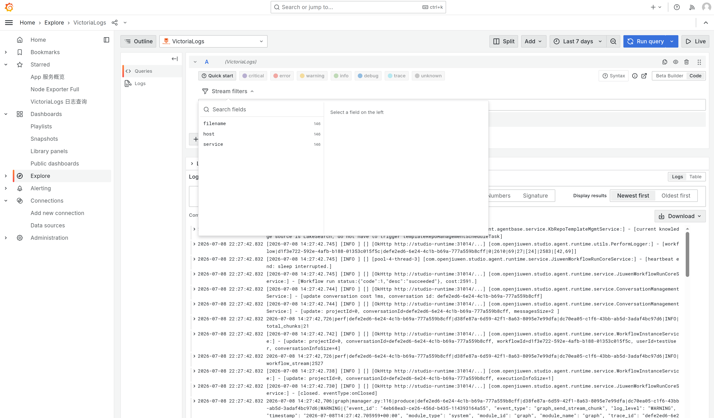

# 日志聚合方案

> ⚠️ **适用范围**：本方案（VictoriaLogs + Vector + Grafana）只适用于 **docker-compose 部署**（`deploy/docker-compose.yml`）。K8s 场景请使用日志采集 DaemonSet 和集中式日志存储。

项目提供两套日志聚合栈（均基于 docker-compose），按部署规模选择：

| | **L1 单机模式** | **L2 跨节点模式** |
|---|---|---|
| 适用 | 所有服务同一台主机 | app 与监控分机部署 |
| 存储 | VictoriaLogs 本地文件系统 | VictoriaLogs 本地文件系统（监控节点盘） |
| 日志查询 | LogsQL 全文索引 | LogsQL 全文索引 |
| 鉴权 | 仅本机 Docker 网络 | nginx-gateway HTTPS + 写入/查询分权 Basic Auth |
| 文件位置 | `deploy/docker-compose.yml`（`profiles: [logging]`） | `deploy/observability/` |
| 启停 | `./deploy.sh logging` | `./deploy.sh monitor`（监控节点）+ `./deploy.sh logging-remote`（app 节点） |

两套都使用 **VictoriaLogs + Vector + Grafana**，查询语言、Dashboard 和排障方式一致。

---

## L1 单机模式（所有服务同机）

### 架构
```
app 文件日志 ──命名卷──┐
                       ├─▶ Vector ──push──▶ VictoriaLogs(本地存储) ──▶ Grafana
Docker 容器标准输出 ───┘
```
四个 app 服务把关键日志写命名卷，Vector 以只读方式 tail，并通过 Elasticsearch Bulk API 写入本机 VictoriaLogs。MySQL、Redis、MinIO、Grafana、VictoriaLogs 等基础设施的标准输出通过 Docker socket 补充采集；Docker 源按 Compose project label 限定范围，并排除已有文件采集的四个 app 容器，避免采集同机无关容器和重复日志。Vector 自身使用 `internal_logs`，避免采集回路。首次启动从文件开头采集，之后依赖持久化 checkpoint 续采；文件源使用内容校验和识别轮转文件，并使用持久化磁盘缓冲。日志栈用 `profiles: ["logging"]` 隔离，默认 `./deploy.sh start` 不启动。

> Docker socket 即使只读挂载，也能暴露较多 Docker daemon 元数据和接口能力。仅允许可信的 Vector 镜像及管理员修改其配置。Docker 标准输出源是补充通道；关键业务日志仍以具备 checkpoint、确认和磁盘缓冲的文件链路为准。Docker stdout/stderr 默认按每文件 100 MiB、最多 5 个文件轮转，即每容器本地上限约 500 MiB；只影响 `docker logs` 的本地历史，不会删除已经进入 VictoriaLogs 的日志。

### 启停
```bash
cd deploy
./deploy.sh start          # 先确保 app 在跑（日志才会写入命名卷）
./deploy.sh logging        # 启动日志栈（等价 logging start）
./deploy.sh logging stop   # 停止
./deploy.sh logging status
```
Grafana：`http://<宿主机IP>:3000/`（admin / admin）

---

## L2 跨节点模式（app 与监控分机）

### 核心设计
1. **Vector 跟 app 走**（每个 app 节点一个）—— 日志文件是本地的，跨节点读不到。
2. **VictoriaLogs + Grafana + gateway 集中**在监控节点。
3. **本地存储**（VictoriaLogs 存监控节点本地盘，无对象存储依赖）。

### 架构
```
┌─ app 节点 1 ─┐  ┌─ app 节点 2 ─┐        ┌─ 监控节点 ──────────────────────┐
│ app 服务     │  │ app 服务     │        │  nginx-gateway (BasicAuth)      │
│ Vector       │  │ Vector       │ ─HTTPS─▶│     ↓                           │
│ host=node-1  │  │ host=node-2  │        │  VictoriaLogs (本地存储)         │
└──────────────┘  └──────────────┘        │  Grafana ─直连─ VictoriaLogs    │
   每个 app 节点一个 Vector，             │                                │
   可水平扩展到 N 个，统一 push 到 gateway  │                                │
                                          └──────────────────────────────────┘
```
> gateway 默认强制 HTTPS，并为 Vector 写入和外部查询使用两套独立凭据。自签名 CA 由监控节点生成，必须安全复制到 app 节点。

### 部署步骤

**① 监控节点**（用 deploy.sh 统一入口，或直接跑脚本）：
```bash
cd deploy
./deploy.sh monitor                # 启动（首次会生成 observability/.env，改完再跑）
./deploy.sh monitor stop           # 停止
./deploy.sh monitor status         # 状态
```

**② app 节点**（先 app 后 vector，顺序不能反）：
```bash
cd deploy
./deploy.sh start          # 1) 先启动 app 服务（建立命名卷）
./deploy.sh logging-remote # 2) 再启动远程 vector（push 到监控节点）
```

监控节点和 app 节点都使用 `deploy/observability/.env`。每个 app 节点需设置自己的
`NODE_NAME`，将 `LOGS_GATEWAY_HOST` 指向与证书 SAN 一致的监控节点地址，并配置相同的
`LOGS_WRITE_USER/LOGS_WRITE_PASSWORD`。监控节点启动后，还需把 `config/gateway-ca.crt`
安全复制到 app 节点。旧版本的 `.env.promtail` 已取消，升级时请把其中的节点和 Gateway 配置合并进 `.env`。

**③ 查询**：浏览器开监控节点 `http://<监控节点IP>:3000/`，Explore → VictoriaLogs。

### 前提条件（跨节点必须满足）
- **网络可达**：app 节点 → 监控节点 gateway 端口
- **时钟同步**：所有节点 chrony/NTP 对齐
- **app 服务先起**：命名卷由 app 服务创建，Vector 用 external 卷引用它们
- **Compose project 隔离**：监控端和采集端默认分别使用 `observability-monitor` / `observability-agent`，同机演练时互不误删

---

## 日志生命周期：自动清理（VictoriaLogs retention）

VictoriaLogs 默认保留 **7 天**，可通过 `VICTORIA_LOGS_RETENTION` 配置。超期日志自动删除。

Vector 会从 Java、Python runtime 和 NGINX 日志正文解析事件时间，并将其写入 VictoriaLogs
的 `_time`。首次导入历史文件时，保留期和 Grafana 时间范围均按日志真实发生时间计算，
不会把历史错误误判为采集时刻的新错误；无法识别时间格式时才回退到采集时间。

### 关键注意
1. **retention 是时间维度**。`VICTORIA_LOGS_MAX_DISK_USAGE_BYTES` 是容量硬上限，默认 10 GiB 且启动脚本禁止设为 0；`VICTORIA_LOGS_MIN_FREE_DISK_BYTES` 默认预留 2 GiB，空间不足时 VictoriaLogs 会停止写入以保护宿主机。请结合宿主机磁盘容量调整。
2. **VictoriaLogs 用本地存储**（不是对象存储）。监控节点盘满会影响 VictoriaLogs、Grafana 和 Docker 本身。
3. **app 节点也有盘满风险**：除 app 自己的滚动日志外，后端不可用时 Vector 会写持久化缓冲。用 `VECTOR_BUFFER_MAX_SIZE` 限制缓冲上限。

---

## LogsQL 查询（VictoriaLogs，L1/L2 通用）

Grafana → Explore → VictoriaLogs datasource：
```
*                                  # 所有日志
_stream:{service="manager"}        # 按 service 过滤（LogsQL stream filter）
_stream:{service="runtime"} WARN   # runtime 的 WARN 日志（全文搜索）
_stream:{service="mysql"}          # MySQL 容器标准输出
trace_id:="<完整 trace_id>"         # 按 trace 精确查询
WARN                                # 所有服务的 WARN
```

> **VictoriaLogs 变量限制**：Grafana 变量查询（`field_values`/`label_values`）在当前 plugin 版本报 "missing field"（[Issue #308](https://github.com/VictoriaMetrics/victorialogs-datasource/issues/308)）。Dashboard 的服务筛选暂用 **custom 变量**，主机和 Trace ID 使用文本框过滤。

Dashboard 同时展示日志量趋势、WARN/ERROR 趋势、高频错误模式、独立 ERROR/FATAL 完整日志、采集器/解析状态以及原始日志。主机变量是正则文本框，默认 `.*`；L2 新增节点无需修改 Dashboard，输入完整节点名即可精确筛选。本方案刻意不引入指标监控和告警；采集异常通过 `service=vector` 和“采集器与解析状态”日志视图排查。

### 入库前敏感信息保护

Vector 在所有文件日志、Docker stdout 和自身日志进入 VictoriaLogs 前，统一遮盖常见的 `Authorization Bearer/Basic`、password、token、API key、secret、access/private key 等键值。应用自身的日志脱敏仍应保留，Vector 是集中入库前的最后一道保护；新增自定义敏感字段时应同步扩展三份 Vector 配置并运行 `vector validate`。

### 日志时区

无时区的 Java/Python/NGINX error 日志按 `APP_LOG_TIMEZONE` 解释，默认 `Asia/Shanghai`；带 `%z` 的访问日志使用日志自身时区。所有节点必须保持 NTP/chrony 同步，修改时区后需要重启 Vector。

## L2 日志网关 TLS 证书管理

TLS 只用于 app 节点 Vector 到监控节点 NGINX Gateway 的跨节点日志上报。证书过期、证书不受信任或 SAN 与 `LOGS_GATEWAY_HOST` 不一致时，Vector 会拒绝连接，集中日志停止更新；Manager、Service、Runtime、Console 及其依赖的核心业务不经过该网关，因此不会直接中断。应用本地文件日志仍会继续产生，Vector 会在容量上限内使用磁盘缓冲，故障持续过久仍可能造成部分日志无法集中入库。L1 单机日志链路使用 Compose 内部网络，不受该证书影响。

### 证书来源与保存位置

监控节点首次执行 `./deploy.sh monitor` 时，如果证书不存在，部署脚本会使用 OpenSSL 生成 RSA 2048 自签名证书。证书的 CN 和 SAN 来自 `.env` 中的 `LOGS_GATEWAY_HOST`：IP 地址写入 IP SAN，域名写入 DNS SAN。默认有效期由下列变量控制：

```env
LOGS_GATEWAY_HOST=monitor.example.com
LOGS_GATEWAY_CERT_DAYS=825
```

证书文件位于监控节点 `deploy/observability/config/`：

- `gateway.crt`：NGINX 当前使用的服务端证书，可公开分发。
- `gateway.key`：服务端私钥，只能保存在监控节点，脚本设置为 `600` 权限。
- `gateway-ca.crt`：app 节点 Vector 使用的信任证书；轮换期间会临时同时包含新旧证书。

必须通过可信渠道将 `gateway-ca.crt` 分发到每个 app 节点的同一路径，禁止分发 `gateway.key`。Vector 同时启用证书链和主机名校验，不能使用 `--insecure` 或关闭 TLS 验证绕过证书问题。若生产环境已有企业 CA 或内部 PKI，可用其签发的证书替换自签名证书，但 SAN 必须覆盖 `LOGS_GATEWAY_HOST`。

### 有效期检查

当前没有自动续期和到期告警。管理员应将以下命令纳入月度巡检：

```bash
cd deploy
./deploy.sh monitor cert-status
```

命令会显示证书主体、签发者、生效时间、过期时间和 SAN；证书将在 30 天内过期或已经过期时输出警告。建议剩余 30～60 天时开始轮换，不要等到过期后处理。

### 无中断证书轮换

以下操作均从监控节点的 `deploy/` 目录执行：

1. 生成新证书和同时包含新旧证书的 CA bundle，但暂不切换网关：

   ```bash
   ./deploy.sh monitor prepare-cert
   ```

2. 将更新后的 `observability/config/gateway-ca.crt` 安全分发到所有 app 节点，然后在每个 app 节点重新加载远程 Vector：

   ```bash
   ./deploy.sh logging-remote stop
   ./deploy.sh logging-remote start
   ```

3. 所有 app 节点均已信任新旧证书后，在监控节点激活新证书：

   ```bash
   ./deploy.sh monitor activate-cert
   ```

   该命令保存旧证书、切换到新证书并重新加载 NGINX。随后应在 Grafana 或 VictoriaLogs 中确认每个 `NODE_NAME` 仍有新日志写入。

4. 确认所有节点持续写入后，淘汰旧证书：

   ```bash
   ./deploy.sh monitor finalize-cert
   ```

5. 再次把只包含新证书的 `gateway-ca.crt` 分发到所有 app 节点，并重新加载远程 Vector。

不得跳过第 2 步直接执行 `activate-cert`，否则尚未信任新证书的 app 节点会立即停止上报。轮换过程中如未确认所有节点恢复写入，不应执行 `finalize-cert`。

### 证书已经过期时的处置

证书已过期时，先执行 `cert-status` 确认过期时间和 SAN，再按上述 `prepare-cert`、分发 CA、`activate-cert`、验证写入、`finalize-cert` 顺序处理。故障期间不要关闭 Vector 的 `verify_certificate` 或 `verify_hostname`；恢复后检查 Vector 磁盘缓冲、各节点最新日志时间和 ERROR/FATAL 面板，确认积压日志已经继续上报。

### L2 凭据轮换（新旧账号重叠）

先在监控节点 `.env` 填写四个 `LOGS_*_NEXT` 值，然后：

```bash
./deploy.sh monitor prepare-credentials
# app 节点改用 NEXT 写入凭据并重启 logging-remote；查询客户端同步切换
./deploy.sh monitor finalize-credentials
```

第一步让网关同时接受新旧账号；第二步把 NEXT 提升为当前凭据并立即淘汰旧账号。脚本不会打印明文口令，`.env` 仍应使用 `chmod 600` 并通过密钥管理渠道分发。

---

## Grafana Dashboard 预览

### Grafana 总览（所有 dashboard）


### VictoriaLogs 日志查询（全文搜索，秒级，按 service 过滤）


### Grafana Explore（临时查询，LogsQL）


---

## 排障（L1/L2 通用）

**Grafana 查不到日志**：
1. app 在跑吗？`./deploy.sh status`（L1）/ 确认 app 服务在跑（L2）。
2. Vector 在读吗？`docker logs --tail 30 <vector容器>`。
3. VictoriaLogs 有数据吗？
   ```bash
   docker exec observability-victoria-logs-1 wget -qO- "http://127.0.0.1:9428/select/logsql/query?query=*&limit=3"
   ```

**某服务没日志（如 runtime）**：
Vector 是「被动 tail」——只在日志文件有新行时才 push。服务没活动时（如 runtime 没跑工作流），日志文件不增长，不 push。**触发该服务活动**（界面调试 agent / 发起对话）。

**push 失败 / VictoriaLogs 收不到数据**：
1. 看 Vector 日志：`docker logs --tail 100 <vector容器>`；健康端点：`http://127.0.0.1:8686/health`。
2. L2 看 gateway 日志：`docker logs <gateway容器>`
3. VictoriaLogs 健康：`docker exec observability-victoria-logs-1 wget -qO- http://127.0.0.1:9428/health`

**L2 特有**：
- Vector 报 401/403 → app 节点与监控节点 `.env` 中的 Gateway 凭据不一致
- Vector 报 connection refused / no route → 监控节点 gateway 未启动或 `LOGS_GATEWAY_HOST` IP 写错
- Vector external 卷不存在 → app 服务没先启动

**VictoriaLogs dashboard 变量报 "missing field"**：
VictoriaLogs plugin 的动态变量查询（field_values）不支持。用 **custom 变量**（硬编码选项）。

**常见配置报错速查**：

| 报错 | 根因 | 修复 |
|---|---|---|
| Grafana `Plugin not found` | 未使用项目的内置插件镜像 | 配置 `${GHCR_IMAGE_REPOSITORY}/grafana-victorialogs:${GRAFANA_IMAGE_TAG}` 或显式 `GRAFANA_IMAGE`，不要在容器启动时在线安装 |
| Vector 缓冲持续增长 | VictoriaLogs 或 gateway 不可达 | 修复后端后观察缓冲回落，并确认 Vector 无重试错误 |
| gateway `htpasswd Permission denied` | htpasswd 权限过严 | `chmod 644`（deploy-monitor.sh 已默认） |
| Vector push `no route to host` | LOGS_GATEWAY_HOST IP 写错 | 确认是监控节点真实 IP（`hostname -I`） |

---

## 演进路径

| 级别 | 形态 | 适用 |
|---|---|---|
| **L1** | 单机 + VictoriaLogs 本地存储（当前内置） | 1-2 个 app 节点 |
| **L2** | 单监控节点 + VictoriaLogs 本地 + gateway | 中小规模生产 |
| L3 | 监控节点 HA（多副本 + 共享存储）；Grafana 多副本 + 共享 DB | 监控节点不能单点 |

**L1 → L2** 增加跨节点集中采集和鉴权网关。VictoriaLogs 当前使用本地存储，监控节点是单点；需要更高可靠性时，应增加备份或评估支持共享存储的集群方案。
